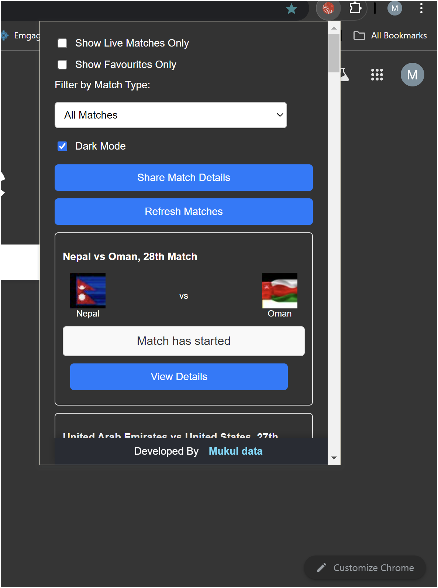
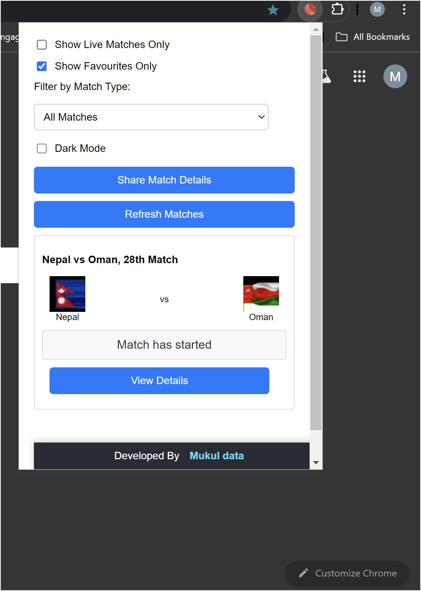

# Chrome Extension: Live Cricket Match Tracker(MatchFeed)

## Overview

MatchFeed is a Chrome extension that provides users with real-time information about ongoing cricket matches. Users can view details about the matches, filter their view, and store their favorite matches locally for quick access.

## Features

1. **Match Information**:
   - Displays the teams participating in a match.
   - Shows the current status of the match.
   - Includes a "View Details" button to access match type, venue, date, and options to add or remove matches from favorites.
   - Favorites are stored in the browser's local storage for easy access.

2. **Data Fetching**:
   - On the first visit of the day, live match data is fetched from the Cric API.
   - If the user refreshes or revisits the extension multiple times within the same day, match data is retrieved from local storage instead of making additional API calls.

3. **Filter Options**:
   - Users can filter matches by:
     - Showing live matches only.
     - Showing favorite matches only.
     - Filtering by match type (e.g., Test, ODI, T20).

4. **Dark Mode**:
   - A dark mode toggle is available for users who prefer a darker interface.

5. **Share Match Details**:
   - Users can share details of filtered matches via email or WhatsApp, making it easy to communicate match information with friends.

6. **Match Timer**:
   - Displays a countdown timer for matches that have not yet started, showing the remaining time until the match begins.

## Installation

1. Download or clone this repository.
2. Open Chrome and navigate to `chrome://extensions/`.
3. Enable "Developer mode" in the top right corner.
4. Click on "Load unpacked" and select the directory where the extension files are located.
5. MatchFeed extension should now be visible in your extensions list.

## Usage

- Click the extension icon in the Chrome toolbar to open the MatchFeed .
- Use the filter options to customize the displayed matches according to your preferences.
- Click on "View Details" for more information about each match.
- Toggle dark mode for a comfortable viewing experience.
- Share match details via email or WhatsApp using the provided options.
- Add or remove matches from favorites as desired, with changes saved automatically to local storage.

## Preview of chrome extension

#### Shows the loading and filters available

#### Shows the data fetched from api 

#### View details modal 

#### Share button 

#### Dark mode view 

#### Apply Filters 

---------

## Acknowledgments

- Thank you to the Cric API (https://cricketdata.org/) for providing the data for live matches.
- Special thanks to the open-source community for the resources and tools that made this project possible.

